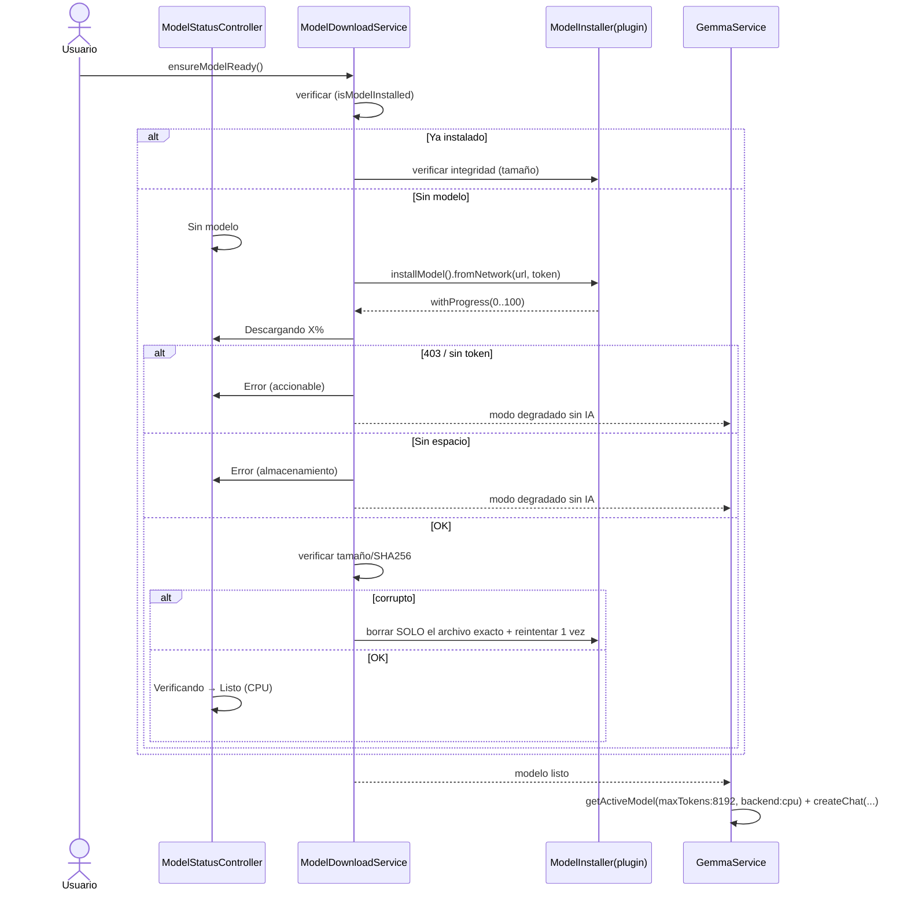
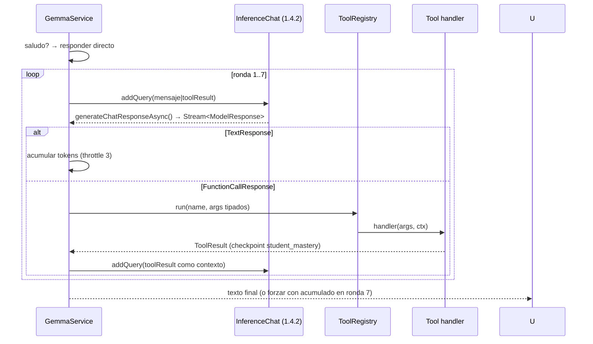
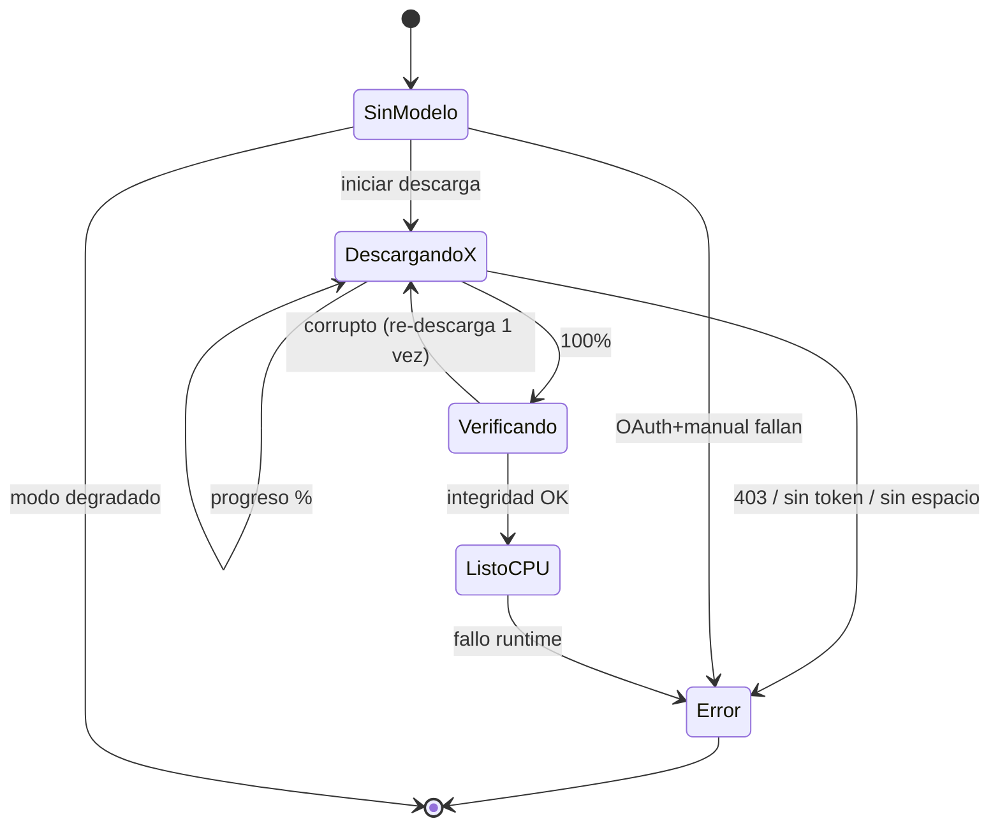

# Design: gemma4-runtime — Gemma 4 E2B IT on-device (flutter_gemma 1.4.2)

## Technical Approach

Migrar la capa de inferencia a `flutter_gemma` 1.4.2 (pin exacta) con `ModelType.gemma4` + `ModelFileType.litertlm`: modelo gated `gemma-4-E2B-it.litertlm` (2.59 GB) instalado vía `installModel(...).fromNetwork(url, token)` idempotente, verificado (tamaño/SHA256) antes de `createModel`, backend CPU fijo, tool calling nativo (`FunctionCallResponse`) en bucle de 7 rondas, estado de modelo visible en el chip de Yachay, y fallback conservado solo como modo degradado sin IA. El diseño introduce **seams de adapter** (instalación e inferencia) para que los tests corran sin red ni plugin nativo. Responde a las 5 specs: gemma-model-download (REQ-01..06), gemma-model-status (REQ-01..04), ai-streaming (REQ-01..02), ai-tool-dispatcher (REQ-01..04), ai-fallback (REQ-01..03).

**Hallazgo de API verificado en pub cache 1.4.2**: `getResponseAsync()` → `Stream<String>` vive en `InferenceModelSession`. Para Gemma 4, los tool calls NO llegan como items del stream: se parsean del `lastRawResponse` al final del stream y se entregan como `FunctionCallResponse` vía `InferenceChat.generateChatResponseAsync()` (chat.dart L466-489, `SdkResponseParser.extractToolCalls`). Consecuencia: el wrapper de streaming usa `session.getResponseAsync()`; el bucle de dispatch usa `chat.generateChatResponseAsync()` (que internamente consume ese stream). Ambos son API 1.4.2; queda documentado como seam, no como ambigüedad.

## Architecture (deep modules)

| Módulo | Interface (pequeña) | Implementation (profunda) | Seam | Depth / Leverage |
|---|---|---|---|---|
| `ModelDownloadService` | `ensureModelReady()` + notificaciones de progreso | verificación → OAuth/token → `installModel` nativo → verificación de integridad → re-descarga acotada; errores tipados (403/sin espacio/corrupto) | `ModelInstaller` (adapter del plugin) + `TokenProvider` + `ModelIntegrityVerifier` inyectados; fake en tests simula descarga/progreso/403 **sin red** | Un solo `ensureModelReady()` cubre todo el ciclo + los 6 escenarios de la spec |
| `GemmaService` (reescrito) | `cargarModelo()` / `procesarMensaje()` / `sendWithStreaming()` / `dispose()` / `activeBackend` | init CPU vía `getActiveModel`, `createChat` 1.4.2 (systemInstruction/maxOutputTokens/toolChoice), bucle nativo 7 rondas, timeout 30s, degradado en todo fallo | `GemmaInferenceAdapter` (adapter del plugin: `getActiveModel`/`createChat`/`getResponseAsync`/`activeBackend`); fake evita el FFI nativo en tests | Todo el dispatch + streaming + error recovery detrás de 5 métodos |
| `HuggingFaceOAuth` + `TokenStore` | `TokenProvider.getAccessToken()` | PKCE S256 (code_verifier/challenge, auth URL, exchange), persistencia, token manual | `TokenStore` (shared_preferences) inyectable | OAuth completo reducido a "dame un token o null" |
| `ModelStatusController` | `ValueNotifier<ModelStatusInfo>` | máquina de estados Sin modelo→Descargando→Verificando→Listo(CPU)→Error | — (ValueNotifier puro, widget test directo) | Transiciones visibles sin acoplar UI al runtime |
| `FallbackDispatcher` | `dispatch(String)` (sin cambios) | reframe documental: modo degradado sin IA; capa 2 ya incluye keywords Yachay | — | Se conserva tal cual; solo cambia el contrato semántico |

Flujo de dependencias: `YachayScaffold` → `GemmaService`/`ModelStatusController` → `ModelDownloadService` → `ModelInstaller`(adapter real `FlutterGemma.installModel`) + `TokenProvider` → `HuggingFaceOAuth`/`TokenStore`.

## ADR (tabla)

| # | Decisión | Alternativas | Rationale |
|---|---|---|---|
| ADR-1 | `flutter_gemma: 1.4.2` pin exacta | mantener 0.10.6 | Inviable quedarse: `ModelType.gemma4`, `litertlm`, `installModel` solo existen en 1.4.2 (verificado en pub cache); entorno Dart 3.12.2/Flutter 3.44.8 compatible |
| ADR-2 | OAuth PKCE propio `com.aprendoplus.app://oauthredirect` + token manual respaldo | solo token manual; copiar client_id de la referencia | Repo gated exige login HF; manual = respaldo sin fricción hackathon; credenciales propias, nunca las de la referencia |
| ADR-3 | Backend CPU fijo, sin selector | selector GPU/NPU en settings | Predecible en 2 GB RAM (XNNPack); evita la trampa de idempotencia de la referencia (`if (_initialised) return` + re-init). Sin selector → `dispose()` real NO requerido; igual se mantiene `close()` seguro |
| ADR-4 | Eliminar legacy ahora (gates, parser, grammar, GGUF/MethodChannel) | camino dual con gates | Deuda del cambio previo; sin camino dual; recuperable por git; grep=0 como criterio de éxito |
| ADR-5 | NO copiar `dispose()`+`deleteModel()` ni limpieza nuclear de archivos | copiar `_cleanupModelFiles()` de la referencia | Borraría la DB sqflite del estudiante (REQ-06); única limpieza: archivo del modelo con nombre exacto |
| ADR-6 | Modelo externo, no versionado | commit del `.litertlm` al repo | 2.59 GB; re-descarga tras desinstalar es comportamiento aceptado (REQ-05) |

## Sequence diagrams

### 1. Bootstrap (con caminos de error)



### 2. Dispatch nativo (máx 7 rondas)



### 3. Chip de estado



## Data Flow

```
YachayScaffold ── listen ──> ModelStatusController (ValueNotifier<ModelStatusInfo>)
      │                            ▲
      │ cargarModelo()             │ feed
      ▼                            │
  GemmaService ──ensureModelReady──> ModelDownloadService ──> ModelInstaller (plugin)
      │                                 │  ──> TokenProvider → HuggingFaceOAuth/TokenStore
      ▼                                 ▼
  InferenceChat ──procesarMensaje──> ToolRegistry.run → Tool handlers → student_mastery (sqflite)
      │
      └──fallo en cualquier punto──> FallbackDispatcher (modo degradado, nunca crash)
```

## File Changes

| File | Acción | Descripción |
|---|---|---|
| `pubspec.yaml` | Modify | `flutter_gemma: 1.4.2` (pin); + `flutter_web_auth_2`, `http`, `crypto`, `shared_preferences` |
| `lib/modules/gemma/gemma_inference_adapter.dart` | Create | Seam del plugin: `getActiveModel`, `createChat`, `getResponseAsync`, `activeBackend`, `close` |
| `lib/modules/gemma/gemma_service.dart` | Rewrite | API 1.4.2, CPU fijo, dispatch nativo, sin gates/legacy/MethodChannel |
| `lib/modules/gemma/model_download_service.dart` | Create | `ensureModelReady()` + verificación + re-descarga acotada |
| `lib/modules/gemma/model_installer.dart` | Create | Adapter real de `installModel(...).fromNetwork()` + verificación de integridad |
| `lib/modules/gemma/huggingface_oauth.dart` | Create | PKCE propio (`com.aprendoplus.app://oauthredirect`) |
| `lib/modules/gemma/token_store.dart` | Create | Persistencia token (shared_preferences) |
| `lib/modules/gemma/model_status.dart` | Create | `ModelStatus` enum + `ModelStatusController`/`ModelStatusInfo` |
| `lib/modules/gemma/action_parser.dart`, `grammar_builder.dart` | Delete | Reemplazados por function calling nativo |
| `lib/modules/gemma/fallback_dispatcher.dart` | Modify | Solo doc/reframe "modo degradado sin IA" |
| `lib/modules/yachay/screens/yachay_scaffold.dart` | Modify | Chip con estados + bootstrap previo + escucha del controller |
| `android/app/src/main/AndroidManifest.xml` | Modify | `intent-filter` `com.aprendoplus.app://oauthredirect` |
| `test/modules/gemma/*` | Modify/Delete | Contract tests 1.4.2 (adapter fake), download, oauth, chip; eliminar mocks de canal legacy |

## Interfaces / Contracts (firmas de alto nivel)

```dart
// seam: instalación del plugin (testeable sin red)
abstract class ModelInstaller {
  Future<bool> isModelInstalled();
  Future<void> install({required String url, String? token,
      void Function(int percent)? onProgress}); // throws ModelDownloadException
}
enum ModelDownloadFailure { forbidden, unauthorized, noSpace, network, corrupt, unknown }

// seam: verificación de integridad (solo archivo exacto, nunca limpieza nuclear)
abstract class ModelIntegrityVerifier {
  Future<bool> verify({bool fullCheck = false}); // size siempre; SHA256 tras descarga
  Future<void> deleteCorruptFile();              // nombre exacto conocido
}

// seam: token (OAuth PKCE o manual)
abstract class TokenProvider { Future<String?> getAccessToken(); }
abstract class TokenStore  { Future<String?> read(); Future<void> write(String t); Future<void> clear(); }
class HuggingFaceOAuth implements TokenProvider { /* PKCE: generateAuthUrl, exchangeCodeForToken */ }

class ModelDownloadService {
  ModelDownloadService({required ModelInstaller installer,
      required ModelIntegrityVerifier verifier, required TokenProvider tokens,
      required ModelStatusController status});
  Future<ModelDownloadResult> ensureModelReady(); // verify→download→verify, idempotente
}

// seam: inferencia del plugin (testeable sin FFI)
abstract class GemmaInferenceAdapter {
  Future<bool> loadModel({int maxTokens = 8192});          // getActiveModel(backend: cpu)
  Future<void> createChat({required String systemInstruction,
      required int maxOutputTokens, required List<Tool> tools}); // toolChoice: auto
  Stream<String> streamResponse();                           // session.getResponseAsync()
  Stream<ModelResponse> streamChatResponse();                // chat.generateChatResponseAsync()
  PreferredBackend? get activeBackend;
  Future<void> close();
}

class GemmaService { // singleton, igual que hoy (forTest/resetForTest se conservan)
  static GemmaService get instance;
  Future<bool> cargarModelo();                       // ensureModelReady + loadModel + createChat
  Future<String> procesarMensaje(String mensaje);    // dispatch nativo, máx 7 rondas
  Future<void> sendWithStreaming(String prompt,
      {void Function(String)? onToken, void Function(MessageStats)? onComplete});
  Future<void> dispose();                            // solo close(), nunca deleteModel
  bool get modeloCargado;
  PreferredBackend? get activeBackend;
}

// estado expuesto al chip
enum ModelStatus { noModel, downloading, verifying, ready, error }
class ModelStatusInfo { final ModelStatus status; final int? progressPercent;
  final String? errorMessage; final String backendLabel; }
class ModelStatusController extends ValueNotifier<ModelStatusInfo> {
  void downloading(int percent); void verifying(); void ready(PreferredBackend? b);
  void error(String message); void reset();
}
```

`ToolRegistry` se conserva tal cual: la firma `Tool(name, description, parameters: Map<String, dynamic>)` de 1.4.2 coincide con la salida de `toFlutterGemmaTools()` (verificado). El prompt Yachay (REQ-04 ai-tool-dispatcher) pasa como `systemInstruction` de `createChat`; las 13 tools se pasan como objetos `Tool` (no renderizadas en texto).

## Testing Strategy (TDD por seams; baseline 209/4, no asumir verde)

| PR | Test (RED primero) | Qué verifica |
|---|---|---|
| 1 | `gemma_142_contract_test.dart` (fake `GemmaInferenceAdapter`) | init llama `loadModel` con backend cpu + `createChat` con systemInstruction/maxOutputTokens≥1024/toolChoice.auto/13 tools; `sendWithStreaming` consume `Stream<String>` y emite `MessageStats`; timeout 30s corta con stats parciales; sin modelo → degradado con tokenCount=0 |
| 1 | `dispatch_native_test.dart` (fake adapter con `Stream<ModelResponse>`) | ronda única resuelve; multi-tool ≤7 rondas; ronda 7 fuerza texto final; checkpoint persiste `student_mastery` |
| 2 | `model_download_service_test.dart` (fake installer) | primera ejecución descarga con progreso 0→100; idempotencia (instalado → skip); 403 → error accionable sin reintento en bucle; corrupto → borra solo archivo exacto + reintento 1 vez → degradado; sin espacio → error sin crash (REQ-01..06) |
| 2 | `huggingface_oauth_test.dart` + `token_store_test.dart` | PKCE: verifier/challenge S256, auth URL, exchange code→token, persistencia; token manual; ambas fallan → `Error` + degradado |
| 2 | `model_status_test.dart` | transiciones del `ValueNotifier` |
| 3 | `yachay_chip_test.dart` (widget) | chip muestra exactamente los 5 estados, nunca "Offline" genérico; `Listo (CPU)` cuando activeBackend=cpu (fallback GPU→CPU incluido) |
| 3 | `yachay_degraded_test.dart` (widget) | sin modelo → chat responde vía FallbackDispatcher, sin crash |
| 1-3 | grep = 0 legacy; `flutter test` mantiene 209+4; `flutter build apk --debug` por PR |

Los tests que mockean el canal `flutter_gemma` (flutter_gemma_service_test.dart) se reemplazan por fakes del adapter (1.4.2 es FFI, no MethodChannel).

## Work Units / auto-chain (3 PRs, ≤400 líneas cada uno)

| PR | Work units (commits convencionales) | Límite |
|---|---|---|
| **PR1** upgrade API | `feat(gemma): pin flutter_gemma 1.4.2` → `feat(gemma): add inference adapter seam + tests` → `feat(gemma): rewrite GemmaService on 1.4.2 API (cpu init, native dispatch, streaming)` | ~400 (si forecast excede: dividir adapter+pubspec en PR1a y rewrite en PR1b — decide sdd-tasks) |
| **PR2** download/OAuth | `feat(gemma): add ModelDownloadService + installer seam + integrity verification + tests` → `feat(gemma): add HuggingFace OAuth PKCE + token store + tests` → `feat(gemma): add model status controller + tests` → `feat(android): add oauthredirect intent-filter` | ~400 |
| **PR3** UI + legacy | `feat(yachay): wire model status chip + bootstrap` → `refactor(gemma): remove legacy gates, parser, grammar, MethodChannel/GGUF` → `docs(gemma): reframe FallbackDispatcher as degraded mode` | ~350 |

Cadena: PR1→branch feature, PR2→rama de PR1, PR3→rama de PR2 (diff limpio). Cada commit lleva su test y su evidencia (`flutter test <foco>`).

## Riesgos de diseño

| Riesgo | Sev | Mitigación concreta |
|---|---|---|
| Dif >400 en PR1 (reescritura de 897 líneas) | Media | sdd-tasks sub-divide PR1a/PR1b; borrados de legacy cuentan en el diff pero la eliminación de ~350 líneas legacy compensa parte |
| `getResponseAsync` vs `FunctionCallResponse`: asumir que el stream entrega tool calls como tokens | Alta | Seam documentado: dispatch usa `chat.generateChatResponseAsync()` (parsea `lastRawResponse`); test de contrato con fake que emite `FunctionCallResponse`; verificación en WDY LX3 |
| `getActiveModel` lanza `StateError` si `installModel` nunca corrió | Alta | Orden de bootstrap garantizado: `ensureModelReady()` (idempotente, deja el spec activo) ANTES de `getActiveModel`; test de contrato; fresh-install en device |
| Firma `Tool` 1.4.2 incompatible | Baja (verificada) | `parameters: Map<String, dynamic>` coincide con `toFlutterGemmaTools()`; test que convierte las 13 tools |
| minSdk/ABI LiteRT-LM FFI | Media | Revisar `build.gradle` del plugin 1.4.2; `flutter build apk --debug` por PR; prueba en WDY LX3 |
| Deep link OAuth no abre | Media | `intent-filter` en Manifest (PR2); `launchMode=singleTop` ya presente; test manual del flujo |
| SHA256 de 2.59 GB lento en cada boot | Media | Size check en boot; SHA256 único post-descarga (`fullCheck: true`) |
| Xet storage / URL gated | Media | URL `resolve/main/gemma-4-E2B-it.litertlm?download=true` con token Bearer; probar descarga real en device |
| Token plano en shared_preferences | Baja | Aceptado para hackathon; documentado; `flutter_secure_storage` fuera de alcance |

## Threat Matrix

N/A — el cambio no introduce routing, shell, subprocesos, automatización VCS/PR ni clasificación de ejecutables. El deep link es una declaración `intent-filter` estática, no un routing ejecutable.

## Migration / Rollout

No hay migración de datos ni feature flags. Orden de entrega: PR1 (inferencia; hasta PR2 la app opera degradada), PR2 (descarga/OAuth), PR3 (UI + legacy). Rollback: git por PR; el modelo es externo (ADR-6). `dispose()` mantiene solo `close()` (ADR-5).

## Open Questions

- [ ] ¿El hash SHA256 del `.litertlm` está publicado en HF? Si no, calcularlo post-descarga en device y persistirlo.
- [ ] ¿`enableSpeculativeDecoding` se deja `null` (default) o se fuerza en WDY LX3? Recomendado: `null` inicial.
- [ ] PR1: confirmar sub-división PR1a/PR1b en sdd-tasks si el forecast de líneas excede 400.
